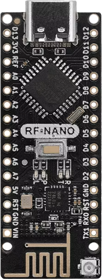
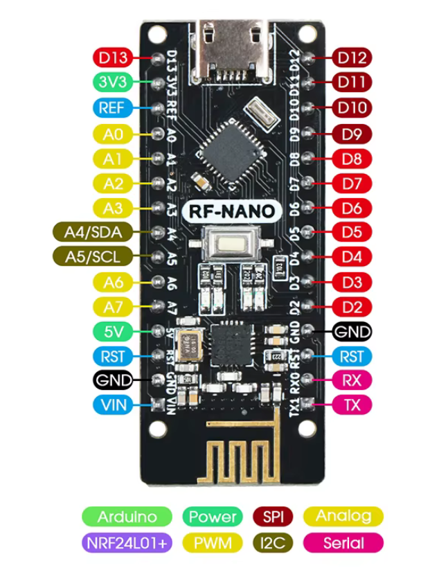
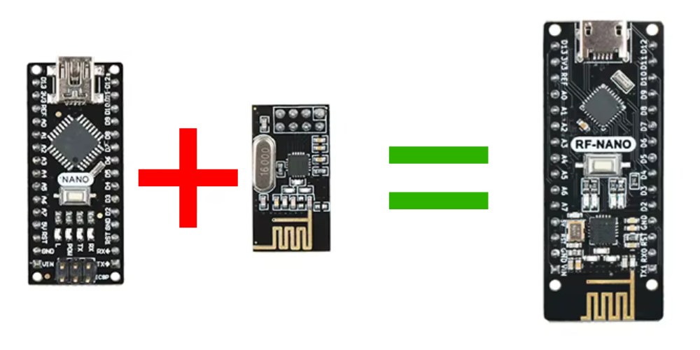

# MouseJacking RF Nano

This project enables **MouseJacking attacks** using the RF24 module with an Arduino Nano. It allows sniffing and transmitting wireless keyboard packets, offering insights into wireless keyboard security vulnerabilities. 

**For Educational and Research Purposes Only:**  
This project is intended to educate and assist researchers in understanding the vulnerabilities of wireless keyboards. Use responsibly, ensuring compliance with all applicable laws and ethical guidelines.

---

## Learn More

If you're interested in mastering HID-based wireless security techniques, including how to use the RF-NANO for MouseJacking attacks, explore this comprehensive course:  

---

## Getting Started

### Requirements

- Arduino IDE
- RF24 library
- nRF24L01 module

### Setup

1. Clone this repository.
2. Open `MouseJacking-RF-Nano-V3.ino` in the Arduino IDE.
3. Upload the sketch to your Arduino Nano.

### Tools

- `tools/attack_generator.py` - Python script to generate attack payloads.
- `tools/keymap.py` - Script to map keyboard keys to payloads.
- `tools/script.txt` - Attack payloads.

---

## Hardware Setup

To set up the hardware, follow the diagram below:

### Pin Mapping

Here is the pin mapping between the ATmega328P (on the Arduino Nano) and the nRF24L01+ module:

| ATmega328P | nRF24L01+ |
|------------|-----------|
| D7         | CE        |
| D8         | CSN       |
| D11        | MOSI      |
| D12        | MISO      |
| D13        | SCK       |

### Arduino Nano + nRF24L01+

Here's an example of the hardware setup:

---

## Legal Warning and Disclaimer

**Important Notice:**

- **This project is for educational and research purposes only.** Unauthorized use of this tool may violate applicable laws and regulations in your jurisdiction.  
- The authors of this project and any contributors do not endorse or condone illegal activities or malicious use of the provided code.
- By using this project, you acknowledge and agree to take full responsibility for its usage. Always ensure compliance with local, national, and international laws.

---

## License

This project is licensed under the MIT License. See the LICENSE file for details.

---
